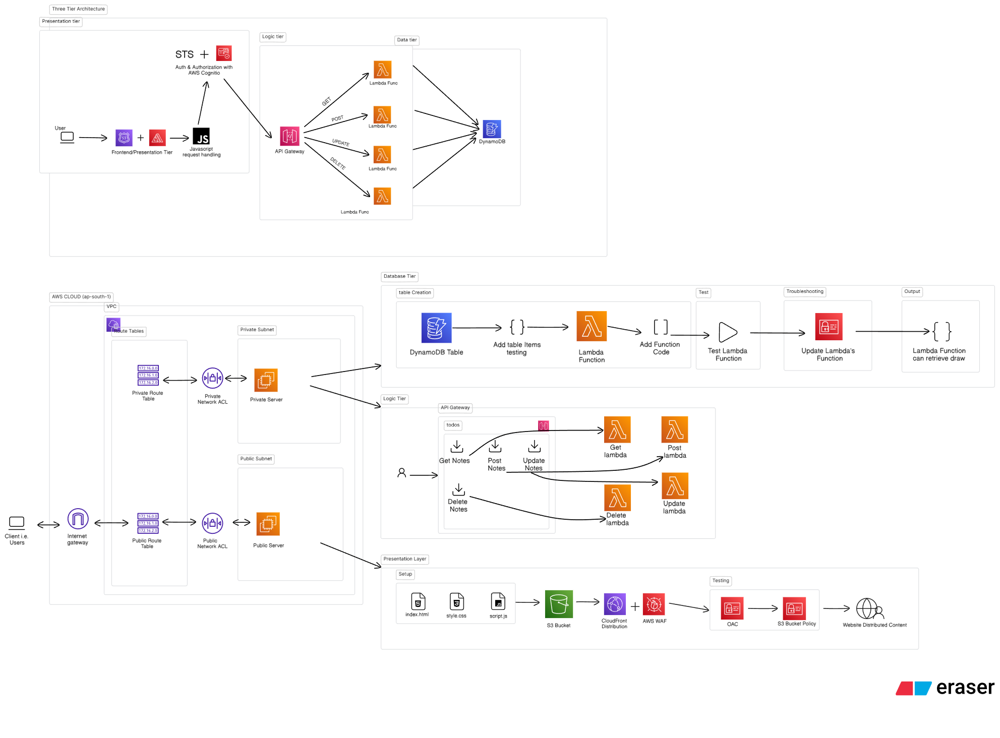

# Todos App

A todo application for adding, editing, and deleting notes, with user authentication.

## Features

- User signup and login (JWT-based authentication)
- Create, edit, and delete todo notes

## Project Structure
```bash
todos-app/
├── backend/
│   ├── auth.py
│   ├── config.py
│   ├── database.py
│   ├── dockerfile
│   ├── main.py
│   ├── OAuth.py
│   ├── schemas.py
│   ├── todos.py
│   ├── requirements.txt
│   └── .env
│
├── frontend/
│   ├── js/
│   │   ├── api.js
│   │   ├── login.js
│   │   ├── signup.js
│   │   └── todos.js
│   ├── css/
│   │   ├── signup.css
│   │   └── todos.css
│   ├── dockerfile
│   ├── nginx.conf
│   ├── index.html
│   ├── login.html
│   └── todos.html
│
├── docker-compose.yml
└── readme.md
```

## Architecture

The application follows a three-tier architecture:



- **Presentation tier** — Frontend (HTML/CSS/JS served via nginx)
- **Application tier** — Backend (FastAPI)
- **Data tier** — Database (PostgreSQL)

## Getting Started

1. Clone the repository
2. Set up environment variables in `backend/.env`
3. Run the application:
```bash
   docker compose up --build
```
4. Access the app at `http://localhost:5500`